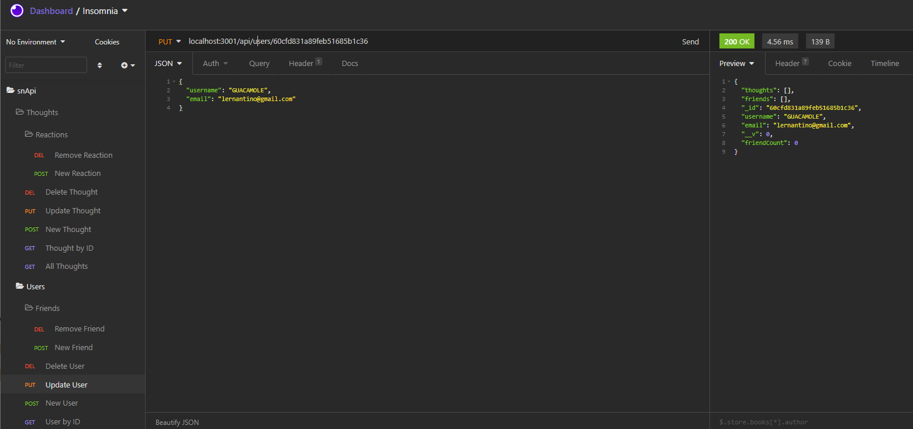

# snApi

    
  

  ## Description
  This project is a backend api for a social media network that utilized a NoSQL server and includes Users, Posts (Thoughts), Reactions, and the ability to add or remove friends. 

  ## Table of Contents
  * [Video](#Video)
  * [Installation](#installation)
  * [Contribution](#contribution)
  * [License](#license)
  * [Questions](#questions)

  ## Video

 

 

  
  ## Installation and Usage
 To install, clone repo onto your local machine. Run "npm install" in the root folder to install dependecies. Once installed run "npm   start to activate the server. From there you can test the routes using Insomnia. 
  

  ## Contribution
  If you would like to contribute to this project feel free. All submissions will be reviewed before publishing. 

  ## License
  This project was done under the MIT license to know more about it, please click here: [MIT](https://choosealicense.com/licenses/mit/)

  ## Questions
  Please visit my GitHub page: https://github.com/Sam-Walters93
  
  For more information please email me at: stwalters314@gmail.com
